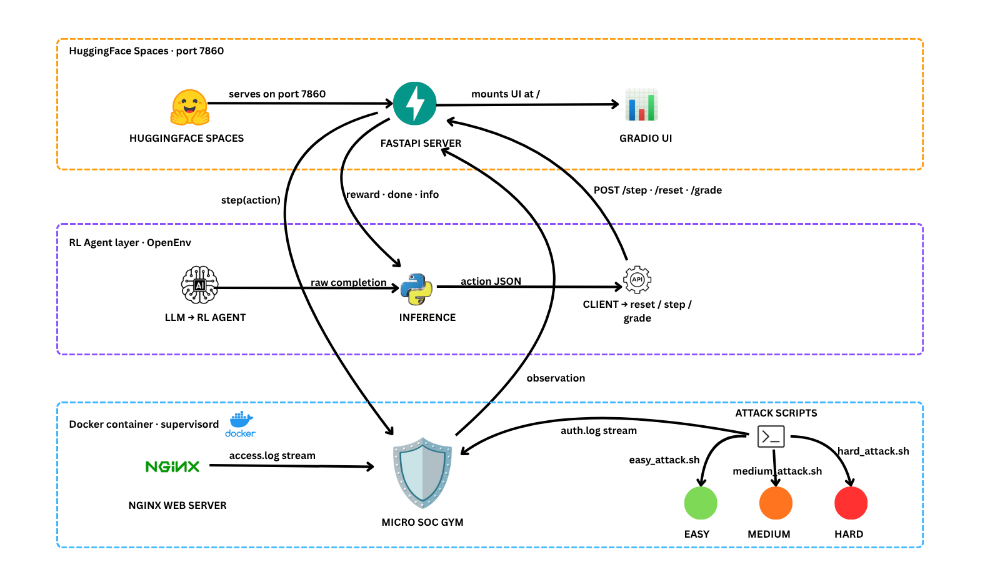

<div align="center">
  
  <h1>Micro SOC Gym</h1>
  <p><strong>A Real time, Docker-Based Benchmark for RL Agents in Security Operations Center (SOC) Triage</strong></p>
  <p>Built for the <b>Meta × Hugging Face × PyTorch OpenEnv Hackathon 2026</b>.</p>
</div>

## Table of Contents

1. [Environment Description & Motivation](#1-environment-description--motivation)
2. [Observation & Action Space](#2-observation--action-space)
3. [Task Descriptions & Difficulty](#3-task-descriptions--difficulty)
4. [Inference & Results](#4-inference--results)
5. [Visual Workflow](#5-visual-workflow)
6. [Setup & Usage Instructions](#6-setup--usage-instructions)
7. [System Architecture](#7-system-architecture)
8. [Project Structure](#8-project-structure)
9. [Pre-Validation Results](#9-pre-validation-results)
10. [Team](#10-team)


## 1. Environment Description & Motivation

### Overview

**Micro SOC Gym** models a real time Security Operations Center (SOC) workload designed for evaluating Reinforcement Learning (RL) agents and LLMs. Rather than interacting with static datasets, agents interface with a real time, monolithic Docker container running production grade services.

The environment runs a FastAPI backend, simulated daemons (`nginx`, `sshd`), and orchestrated attacker scripts. Agents perform threat triage just like real analysts. It parses unstructured server log streams, maps threats and executes exact remediation actions.

### Motivation

In modern Security Operations Centers (SOCs), human analysts are generally overwhelmed by the volume of daily alerts. Because of this workload, anything that is not automated can slip through, leaving networks vulnerable. To safely automate this triage process, we need capable AI. This is why we chose to build Micro SOC Gym.

Standard LLM benchmarks test static multi-choice or simple generation capabilities. **Micro SOC Gym** forces the agent into a proactive system administration role. It challenges an agent's ability to:

1. Handle noisy data streams (identifying signal amidst decoy traffic).
2. Sequentially build and execute a remediation plan.
3. Understand precise constraints to avoid _False Positives_ - where overly aggressive actions can cause system failures.


## 2. Observation & Action Space

This environment is based on the standard **OpenEnv** HTTP JSON schema patterns defined through integrated Pydantic definitions.

### 2.1 Observation Space

State observations are fed continuously to the agent via the `MicroSocGymObservation` dictionary payload:

- **`logs` (String)**: A real-time 50-line stream output representing the targeted log asset (`/var/log/nginx/access.log` or `/var/log/auth.log`).
- **`reward` (Float)**: Immediate reinforcement mapping to the agent's recent action (+1.0 for success, 0.0 for penalties/noise).
- **`done` (Boolean)**: Marks terminal episode conditions (Success, Failure, or Max-Steps Exhaustion).
- **`success` (Boolean)**: Directly indicates if the active threat has been fully neutralized.
- **`info` (String)**: Grader feedback and human-readable context hints.

### 2.2 Action Space

Instead of simple directional movements, the agent manipulates an infrastructure API. The `MicroSocGymAction` requires specifying exactly one remediation `tool` per step:

1. **`block_ip(ip_address: str)`**
   - Targets network ingress. Commits the rogue IP explicitly to the target's `/etc/nginx/blocklist.conf`.
2. **`kill_process(pid: int)`**
   - Transmits a system-level `SIGKILL` to forcefully terminate unauthorized command-and-control background processes.
3. **`delete_file(file_path: str)`**
   - Permanently deletes verified malware, webshells, or backdoor executable scripts from the host disk layer.

---

## 3. Task Descriptions & Difficulty

The environment runs each scenario via a round-robin rotation upon iteration (`/reset`). Agents must shift strategies and remediate based on the active threat.

| Difficulty | Name & Mechanics | Win Condition & Constraints |
| :---: | :--- | :--- |
| **Easy** | **Directory Brute Forcing**<br>A single IP is generating a massive amount of `HTTP 404` errors by brute forcing hidden admin pages (like `/admin` or `/wp-login.php`). | **Goal:** Find the malicious IP in `access.log` and call `block_ip(IP)`.<br>**Constraint:** None |
| **Medium** | **SSH Brute Force**<br>An attacker is brute forcing the server with failed SSH login attempts (visible in `auth.log`), but legitimate admin traffic is happening at the exact same time. | **Goal:** Identify the attacker's IP and call `block_ip(IP)`.<br>**Constraint:** High false-positive penalty. If the agent accidentally blocks the legitimate admin subnet, it triggers an immediate failure. |
| **Hard** | **Active C2 Backdoor**<br>An attacker has dropped a malicious file on the webserver and is actively sending base64-encoded commands to running processes. | **Goal:** Delete the backdoor and kill the malicious process.<br>**Constraint:** The agent must kill the active session using `kill_process(PID)` *and* remove the payload using `delete_file(FILE)`. Doing only one will not stop the attacker. |


## 4. Inference & Results

The environment tests models across progressively harder scenarios. Below is an evaluation run using the `Qwen/Qwen2.5-72B-Instruct` model via our built in ReAct script (`inference.py`). 

The trace shows the agent successfully reading the environment state and calling the correct tools (`block_ip`, `delete_file`, `kill_process`). It achieves a perfect `3.00/3.00` score, resolving all the threats.


## 5. Visual Workflow

To help visualise the environment, we built an interactive Gradio Dashboard which is available at `http://localhost:7860/` when the docker container is run. 

It lets you manually play the role of the responding agent. By reading the logs, triggering tools, and seeing how the environment scores your actions, you can easily understand the mechanics, constraints, and underlying reward logic the Agent has to learn.

https://github.com/user-attachments/assets/e3428fef-4008-47f6-b9df-d95cee8cc7a6

## 6. Setup & Usage Instructions

### 6.1 Running the Docker Container


```bash
# 1. Build the Docker Image
docker build -t micro-soc-gym .

# 2. Run the container
docker run -p 7860:7860 micro-soc-gym
```

**Note:** You can access the **Gradio Dashboard** at `http://localhost:7860/` for manual testing

### 6.2 Run the Agent against all Scenarios

```bash
# 1. Create a virtual environment and install dependencies
python -m venv .venv
source .venv/bin/activate  # (Windows: .\.venv\Scripts\activate)
pip install -r requirements.txt

# 2. Set Hugging Face Hub Credentials
export HF_TOKEN="<your_secure_hugging_face_token>"

# 3. Run the Inference Script
python inference.py
```


## 7. System Architecture

The codebase handles networking logic decoupled from kernel requirements via a supervised orchestration.



## 8. Project Structure

```text
micro_soc_gym/
├── .github/
│   └── workflows/
│       └── sync-to-hf.yml            # GitHub Actions workflow to sync repo to Hugging Face Space
├── media/                            # Static assets for documentation
├── scripts/                          # Subprocess Attack Generators
│   ├── easy_attack.sh                # Volumetric target traffic creator
│   ├── medium_attack.sh              # Mock SSH Brute-Force + Decoys
│   └── hard_attack.sh                # Webshell runtime process simulation
├── server/                           # OpenEnv Backend Services
│   ├── __init__.py                   # Package initializer
│   ├── app.py                        # FastAPI endpoints and Gradio Telemetry Dashboard
│   └── micro_soc_gym_environment.py  # Primary orchestration, grader matrix, and rules engines
├── __init__.py                       # Package initializer
├── client.py                         # Synchronous HTTP validation client
├── Dockerfile                        # Environment runtime manifest & OS provisions
├── inference.py                      # Automated LLM ReAct agent testing loop
├── models.py                         # Application-layer Pydantic schema exports
├── nginx-default                     # Nginx server configuration defaults and simulated routing
├── openenv.yaml                      # OpenEnv space requirement configuration
├── pyproject.toml                    # Python package configuration
├── requirements.txt                  # Python dependencies
├── schema.json                       # Validation schema for standard OpenEnv JSON interactions
├── supervisord.conf                  # Daemon management orchestrator (Nginx, API, Attacks)
├── uv.lock                           # Locked dependency versions (uv)
└── validate-submission.sh            # Local strict validation helper script
```

## 9. Pre-Validation Results

Before deploying, we ran the environment through the given Pre-Validation Script. Everything passed, including the Docker build, Hugging Face Space liveness, and schema checks.


<details>
<summary><b>View Raw Validation Logs</b></summary>

```text
========================================
  OpenEnv Submission Validator
========================================
[11:21:05] Repo:     /c/Users/hp859/Desktop/Meta X Hugging_Face Hacks/micro_soc_gym
[11:21:05] Ping URL: https://harinie4466-micro-soc-gym.hf.space

[11:21:05] Step 1/3: Pinging HF Space (https://harinie4466-micro-soc-gym.hf.space/reset) ...
[11:21:11] PASSED -- HF Space is live and responds to /reset
[11:21:11] Step 2/3: Running docker build ...
[11:21:11]   Found Dockerfile in /c/Users/hp859/Desktop/Meta X Hugging_Face Hacks/micro_soc_gym
[11:21:19] PASSED -- Docker build succeeded
[11:21:19] Step 3/3: Running openenv validate ...
[11:21:33] PASSED -- openenv validate passed
[11:21:33]   [OK] micro_soc_gym: Ready for multi-mode deployment

========================================
  All 3/3 checks passed!
  Your submission is ready to submit.
========================================

```

</details>

## 10. Team

| Name                   | GitHub ID                                               |
|------------------------|---------------------------------------------------------|
| Adithya Menon R        | [adithya-menon-r](https://github.com/adithya-menon-r)   |
| Harinie CB             | [harinie-4466](https://github.com/harinie-4466)         |
| Hari Prasath K         | [hariPrasathK-Dev](https://github.com/hariPrasathK-Dev) |
